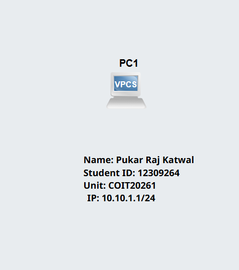
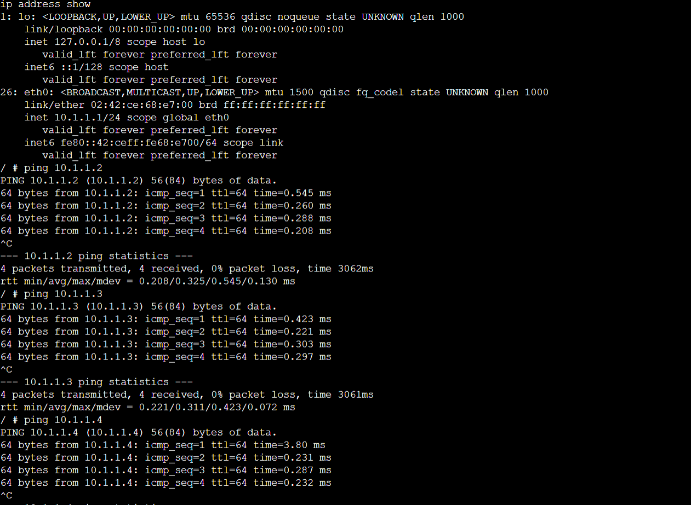

## 1. Introduction

This week focused on understanding the unit structure and preparing the required tools for practical networking labs. It also introduced the use of GitHub and Markdown for maintaining a professional portfolio.

---

## 2. Unit Familiarisation

I reviewed the unit profile to understand:
- Assessment tasks and deadlines  
- Weekly lab requirements  
- Portfolio submission format  

This helped me understand the importance of documenting work regularly.

---

## 3. Software Setup

The following tools were installed and tested:

- VirtualBox – used for running virtual machines  
- GNS3 – used for network simulation and configuration  

Both applications were installed successfully and are working properly.

---

## 4. GitHub Repository

A private GitHub repository was created with the required format:

12316847-COIT20261-2026T1

This repository will be used to store all weekly portfolio tasks and will be shared with the tutor.

---

## 5. Task 1 – Introduction to GNS3

### 5.1 Aim

The aim of this task was to gain basic experience with:
- Creating a project in GNS3  
- Adding a Linux host  
- Assigning a static IP address  
- Running Linux commands  
- Verifying configuration  

---

### 5.2 Project Setup

A new GNS3 project was created:

GNS3-Intro-12309264

A Linux host node was added to the workspace.

---

### 5.3 Annotation

Text was added in the project showing:
- Project name  
- Student name  
- Student ID  
- Date  

This helps make the project clear and organised.

---

### 5.4 IP Address Assignment

The following IP address was selected:

10.10.1.1

This IP was also displayed near the node in the topology.

---

## 6. Network Configuration

The IP address was configured by editing:

/etc/network/interfaces

Configuration used:

auto eth0
iface eth0 inet static
    address 10.10.1.1
    netmask 255.255.255.0
    up sysctl net.ipv4.ip_forward=0

---

## 7. Running and Testing

The node was started and the console was opened.

To verify the IP configuration, the following command was used:

ip address show

Result:
The IP address 10.10.1.1 was displayed successfully, confirming correct configuration.

---

## 8. Outputs

The following files were generated:

---

## 9. Learning Reflection

This task helped me understand:
- Basic usage of GNS3  
- How to configure a static IP in Linux  
- How to verify network settings using commands  

Initially, editing the configuration file was a bit challenging, but after following the steps carefully, I was able to complete it successfully.

---

## 10. Conclusion

Week 01 provided a strong foundation for future networking labs. It introduced essential tools and basic configuration skills that will be used in upcoming tasks.
