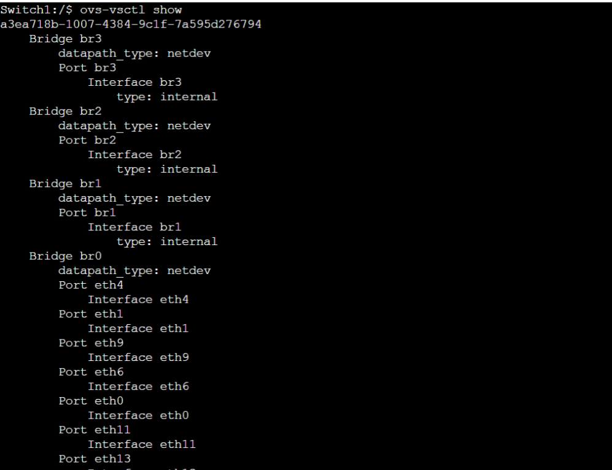

## Introduction

This week focused on Virtual LANs (VLANs) and how they are configured on switches and routers. The lab helped in understanding how networks can be segmented and how communication is controlled between different VLANs.

---

## Task 1: VLAN Configuration on Switch

### Aim
To learn how to configure VLANs using OpenvSwitch.

---

### Network Setup

Project:
Vlan-Basics-12309264  

Devices:
- 4 Linux Hosts  
- 1 OpenvSwitch  

All hosts were connected to the switch (eth1–eth4).

---

### IP Configuration

All hosts were assigned IPs in the same subnet:

- Host1 → 10.1.1.1  
- Host2 → 10.1.1.2  
- Host3 → 10.1.1.3  
- Host4 → 10.1.1.4  

---

### Initial Testing

Before VLAN setup:
- All hosts were able to ping each other  
- Full connectivity confirmed  

---

### VLAN Setup

Based on student ID (12309264), VLAN IDs used:

- VLAN 847 → Host1 & Host2  
- VLAN 848 → Host3 & Host4  

Commands:

ovs-vsctl set port eth1 tag=847  
ovs-vsctl set port eth2 tag=847  
ovs-vsctl set port eth3 tag=848  
ovs-vsctl set port eth4 tag=848  

---

### Testing After VLAN

Results:
- Hosts in same VLAN → Ping successful  
- Hosts in different VLAN → Ping failed  

This confirmed VLAN isolation.

---

## Task 2: VLAN Routing

### Aim
To configure VLANs with a router and enable communication between VLANs.

---

### Network Setup

Project:
Vlan-Router-12309264 

Added:
- 1 Linux Router connected to switch (eth0)

---

### VLAN Configuration

Same VLANs used:
- VLAN 847  
- VLAN 848  

Switch trunk port configured:

ovs-vsctl set port eth0 trunks=[]  

---

### Router Configuration

Created sub-interfaces:

ip link add link eth0 name eth0.847 type vlan id 847  
ip link add link eth0 name eth0.848 type vlan id 848  

Assigned IPs:

ip address add 10.1.1.254/24 dev eth0.847  
ip address add 10.2.2.254/24 dev eth0.848  

---

### Host Configuration

Hosts divided into two subnets:

- VLAN 847 → 10.1.1.0/24  
- VLAN 848 → 10.2.2.0/24  

Default gateway set to router.

---

### Testing

After configuration:
- All hosts could communicate across VLANs  
- Router successfully forwarded traffic  

---

### Outputs

---

## Learning

- Learned VLAN segmentation  
- Understood access vs trunk ports  
- Learned inter-VLAN routing  
- Practiced router sub-interfaces  

---

## Conclusion

Week 05 helped in understanding how VLANs work and how routers allow communication between them. This is important for real-world network design and security.

